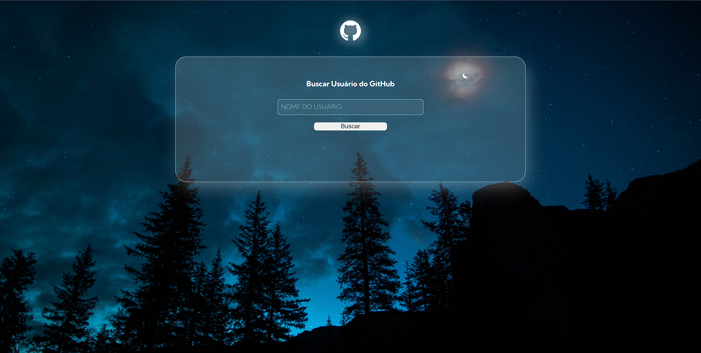
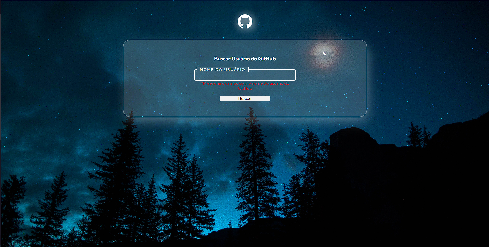
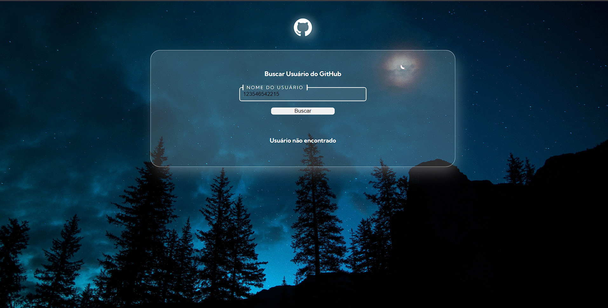
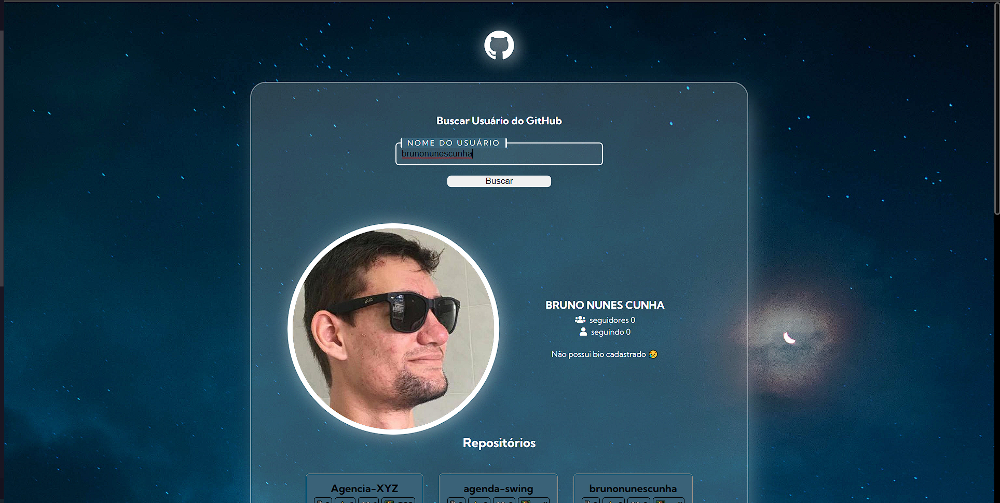

#  Buscando usuários do GitHub  😎

## Sobre o projeto

Nesse projeto é uma Quest do Dev em Dobro. ✨🧙‍♂️

Nessa quets eu dive que criar uma buscar de usuários no GitHub usando o API do github 
#

## Objetivo da Quest
Ao click em buscar ou aperta entrer é gerado uma buscar no gitHub, E se o usuário for encontrado é mostrado a foto, nome, seguidore, seguido ,biografia, 10 repositorios e os 10 utimos eventos do usuário

#

### linguagem usadas

- HTML
- CSS
- JavaScript

#

### Imagens do Projeto

#### tela de buscar

#### Nada preenchido

#### usuário não encontrado

#### Usuário buscado
